# Railway Deployment Quick Reference

## 🚀 Quick Deploy

```bash
# Install CLI
npm install -g @railway/cli

# Login
railway login

# Deploy API
cd packages/api && railway up

# Deploy Webapp
cd packages/webapp && railway up
```

## ✅ Pre-Deployment Checklist

- [ ] All builds passing (`npm run build`)
- [ ] Tests passing (22/22)
- [ ] Health check working (`/health`)
- [ ] Environment variables configured
- [ ] Railway CLI installed
- [ ] Authenticated to Railway

## 🧪 Test Before Deploy

```bash
# Run simulation test
./deployment/scripts/test-railway-simulation.sh

# Run dry-run
./deployment/scripts/deploy-dry-run.sh

# Expected: All tests passed ✅
```

## 📋 Essential Commands

### Deployment
```bash
railway up           # Deploy current directory
railway restart      # Restart service
railway down         # Stop service
```

### Monitoring
```bash
railway logs         # View logs
railway logs --tail  # Follow logs
railway status       # Service status
railway metrics      # Usage metrics
```

### Configuration
```bash
railway variables                    # List variables
railway variables set KEY=value      # Set variable
railway domain                       # Get URL
```

### Rollback
```bash
railway deployments                  # List deployments
railway rollback --deployment ID     # Rollback
```

## 🔧 Environment Variables

### API Required
```bash
NODE_ENV=production
PORT=8080
```

### Webapp Required
```bash
NODE_ENV=production
PORT=3000
VITE_API_BASE_URL=https://your-api.railway.app
```

## 🏥 Health Check

**Endpoint:** `GET /health`

**Configuration:** `railway.json`
```json
{
  "healthcheck": {
    "path": "/health",
    "intervalSeconds": 30,
    "timeoutSeconds": 10
  }
}
```

**Test:**
```bash
curl https://your-api.railway.app/health
```

## 🐛 Troubleshooting

| Issue | Command | Fix |
|-------|---------|-----|
| Build fails | `railway logs` | Check TypeScript errors |
| Won't start | `railway status` | Verify PORT variable |
| Health check fails | `curl .../health` | Check endpoint |
| Variables missing | `railway variables` | Set required vars |

## 📊 Deployment Status

✅ **READY FOR PRODUCTION**

- API Build: ✅ 0 errors
- Webapp Build: ✅ All assets
- Server Tests: ✅ 22/22 passed
- Health Checks: ✅ Operational
- Configuration: ✅ Validated

## 🔗 URLs

After deployment, get URLs:
```bash
# API
cd packages/api && railway domain

# Webapp
cd packages/webapp && railway domain
```

## 📝 Deployment Flow

```mermaid
graph TD
    A[Install Railway CLI] --> B[Login]
    B --> C[Navigate to package]
    C --> D[railway up]
    D --> E[Build & Deploy]
    E --> F{Health Check}
    F -->|Pass| G[✅ Live]
    F -->|Fail| H[Check logs]
    H --> D
```



## 🎯 Success Criteria

- [ ] Health endpoint returns 200
- [ ] API endpoints respond
- [ ] Webapp loads in browser
- [ ] No error logs
- [ ] Metrics look good

## 💡 Pro Tips

1. **Test Locally First**
   ```bash
   npm run build && npm start
   ```

2. **Check Logs Immediately**
   ```bash
   railway logs --tail
   ```

3. **Set Variables Before Deploy**
   ```bash
   railway variables set NODE_ENV=production
   ```

4. **Use Environments**
   ```bash
   railway environment select production
   ```

5. **Monitor Health**
   ```bash
   watch -n 5 'curl -s https://your-api.railway.app/health'
   ```

## 📞 Getting Help

- Railway Docs: https://docs.railway.app
- Discord: https://discord.gg/railway
- GitHub Issues: Repository issues tab

---

**Ready to deploy?** Run: `railway login && cd packages/api && railway up`
